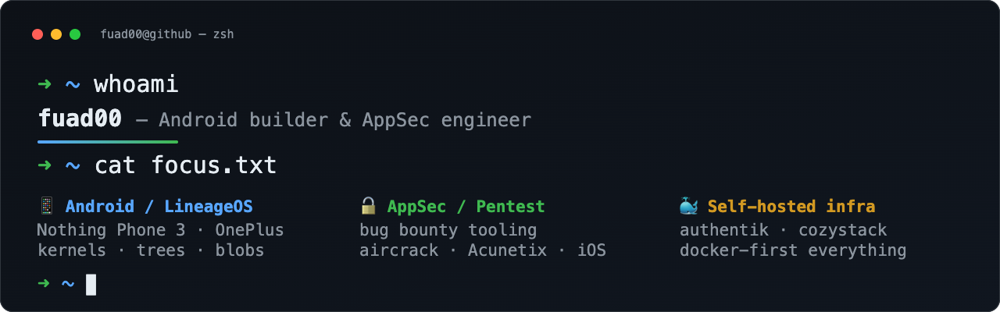

  

##

  
  
  
  

Building LineageOS for phones that shouldn't be abandoned, breaking things I'm allowed to break, and self-hosting what I can.

- 📱 **Android** — LineageOS for Nothing Phone 3 (`sm8735`) & OnePlus 10 Pro (`wly`): kernels, device trees, vendor blobs
- 🔓 **AppSec** — bug-bounty tooling: [`acubot`](https://github.com/fuad00/acubot) (Acunetix × Telegram), [`wifitool`](https://github.com/fuad00/wifitool), [`jb-ios-contacts-cli`](https://github.com/fuad00/jb-ios-contacts-cli)
- 🐳 **Infra** — docker-first: authentik, cozystack, weaviate PoCs
- 🇮🇹 **Side quest** — [learn-italian](https://github.com/fuad00/learn-italian): итальянский для русскоязычных, [живьём](https://fuad00.github.io/learn-italian/)

⌨️ Weekly stack

| Area | Tools |
|---|---|
| Android | repo/manifest, AOSP build system, kernel 6.6, sepolicy |
| AppSec | Acunetix, aircrack-ng, mitmproxy, netsparker, Ghidra-curious |
| Infra | Docker Compose, authentik, zoraxy, rabbitmq, jupyterhub |

